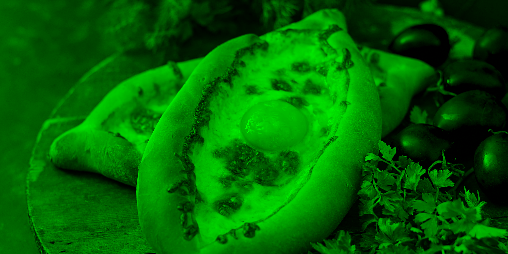
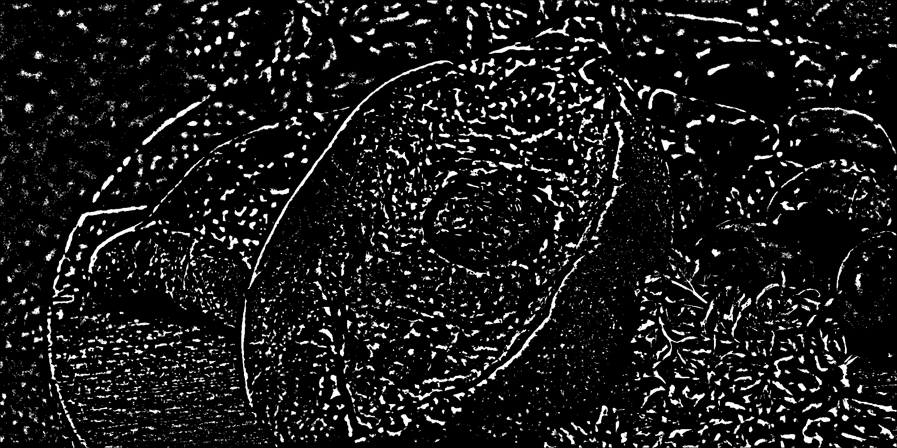
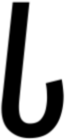

# mephi-avip

## Лабораторная работа №1. Цветовые модели и передискретизация изображений

### Оригинал

    

### Цветовые компоненты

    
    
    

### Яркость

    

### Инверсия

    

### Интерполяция

    

### Децимация

    

### Передискретизация в 2 шага

    

### Передискретизация в 1 шаг

    

## Лабораторная работа №2. Обесцвечивание и бинаризация растровых изображений

Вариант: Адаптивная бинаризация Ниблэка

    
    
    

    
    
    

    
    
    

    
    
    

    
    
    

    
    
    

## Лабораторная работа №3. Фильтрация изображений и морфологические операции

Вариант: Медианный фильтр. Разреженная маска — косой крест

    
    
    

    
    
    

    
    
    

    
    
    

    
    
    

    
    
    

    
    
    

## Лабораторная работа №4. Выделение контуров на изображении

Вариант: Оператор Шарра 3 × 3, G=|Gx|+|Gy|

    
    
    
    

    
    
    
    

## Лабораторная работа №5. Выделение признаков символов

Вариант: Османья

Признаки: [features.csv](output/lab5/features.csv)

     
    
    

     
    
    

     
    
    

## Лабораторная работа №6. Сегментация текста

Вариант: Османья

     
    
    
    

    
    
    

    
    
    

    
    
    

    
    
    

## Лабораторная работа №7. Классификация на основе признаков, анализ профилей

Вариант: Османья

    

1: ('𐒃', 0.97) ('𐒎', 0.69) ('𐒋', 0.67) ...  
2: ('𐒗', 0.96) ('𐒌', 0.80) ('𐒕', 0.75) ...  
3: ('𐒆', 0.96) ('𐒀', 0.86) ('𐒔', 0.84) ...  
4: ('𐒀', 0.96) ('𐒆', 0.92) ('𐒋', 0.91) ...  
5: ('𐒔', 0.95) ('𐒆', 0.90) ('𐒀', 0.88) ...  
6: ('𐒋', 0.97) ('𐒀', 0.95) ('𐒎', 0.90) ...  
7: ('𐒆', 0.96) ('𐒀', 0.86) ('𐒔', 0.84) ...  
8: ('𐒍', 0.94) ('𐒛', 0.87) ('𐒄', 0.87) ...  

𐒃 𐒗𐒆𐒀𐒔 𐒋𐒆𐒍

0 ошибок, 100% символов распознаны верно

    

1: ('𐒃', 0.79) ('𐒎', 0.67) ('𐒏', 0.66) ...  
2: ('𐒗', 0.98) ('𐒌', 0.80) ('𐒅', 0.75) ...  
3: ('𐒆', 0.98) ('𐒀', 0.88) ('𐒔', 0.86) ...  
4: ('𐒀', 0.97) ('𐒋', 0.94) ('𐒆', 0.90) ...  
5: ('𐒕', 0.97) ('𐒈', 0.87) ('𐒔', 0.86) ...  
6: ('𐒋', 0.98) ('𐒀', 0.93) ('𐒎', 0.92) ...  
7: ('𐒆', 0.99) ('𐒀', 0.89) ('𐒔', 0.87) ...  
8: ('𐒜', 0.99) ('𐒈', 0.86) ('𐒐', 0.83) ...  

𐒃 𐒗𐒆𐒀𐒕 𐒋𐒆𐒜 

0 ошибок, 100% символов распознаны верно

    

1: ('𐒏', 0.59) ('𐒁', 0.56) ('𐒘', 0.56) ...  
2: ('𐒗', 0.94) ('𐒌', 0.82) ('𐒅', 0.76) ...  
3: ('𐒆', 0.97) ('𐒀', 0.87) ('𐒔', 0.86) ...  
4: ('𐒆', 0.92) ('𐒀', 0.92) ('𐒔', 0.91) ...  
5: ('𐒔', 0.94) ('𐒆', 0.87) ('𐒈', 0.87) ...  
6: ('𐒀', 0.94) ('𐒒', 0.92) ('𐒆', 0.90) ...  
7: ('𐒆', 0.99) ('𐒀', 0.88) ('𐒔', 0.86) ...  
8: ('𐒜', 0.94) ('𐒈', 0.86) ('𐒐', 0.86) ...  

𐒏 𐒗𐒆𐒆𐒔 𐒀𐒆𐒜

4 ошибки, 50% символов распознаны верно

## Лабораторная работа №8. Текстурный анализ и контрастирование

### Текстура 1

Оригинал, полутон и контрастированный полутон

    
    
    

Гистограммы яркости исходного и контрастированного изображений

    
    

Матрицы для исходного и контрастированного изображений

    
    

    
    

### Текстура 2

Оригинал, полутон и контрастированный полутон

    
    
    

Гистограммы яркости исходного и контрастированного изображений

    
    

Матрицы для исходного и контрастированного изображений

    
    

    
    

