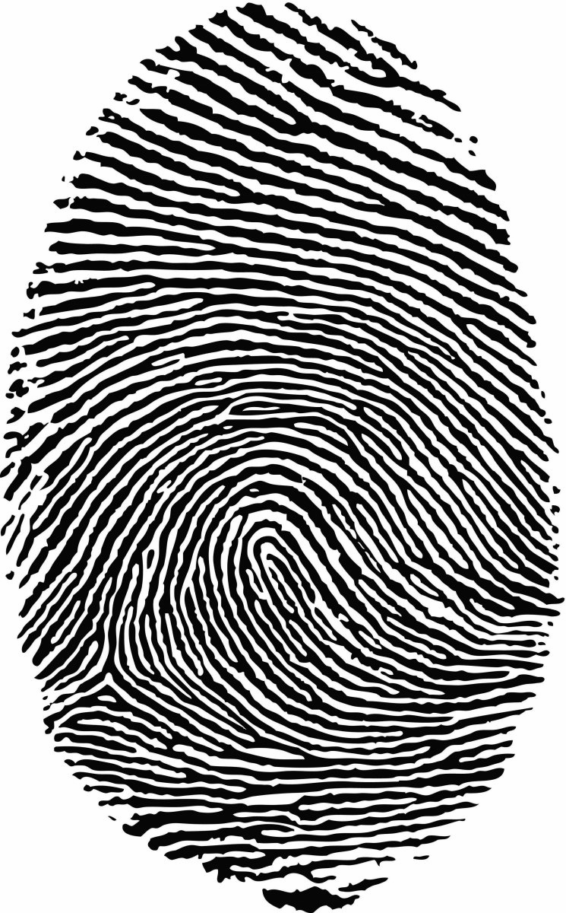
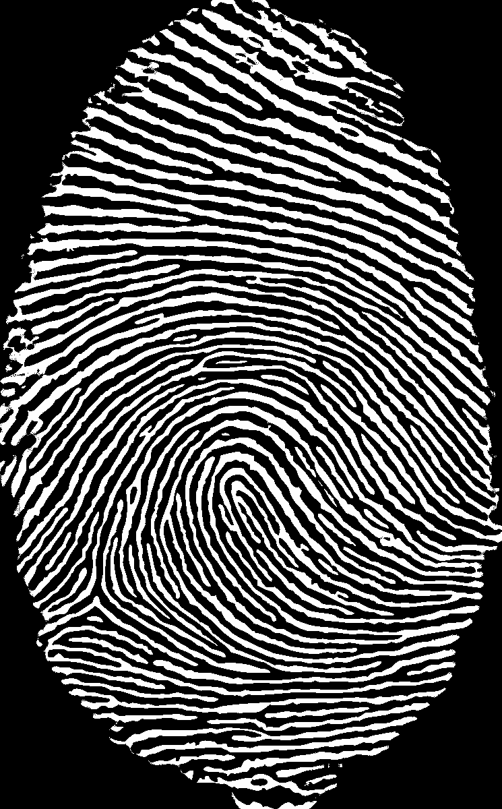
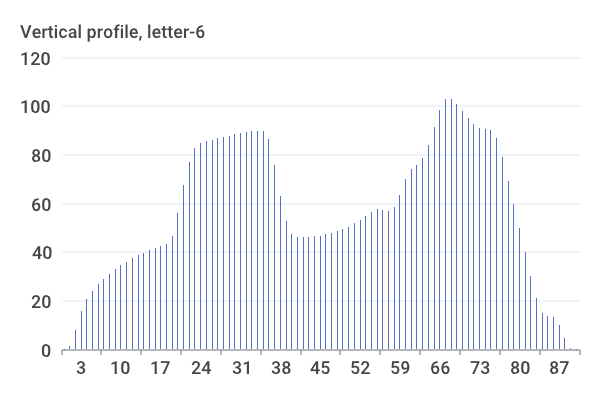

# mephi-avip

## Лабораторная работа №1. Цветовые модели и передискретизация изображений

### Оригинал

    

### Цветовые компоненты

    
    
    

### Яркость

    

### Инверсия

    

### Интерполяция

    

### Децимация

    

### Передискретизация в 2 шага

    

### Передискретизация в 1 шаг

    

## Лабораторная работа №2. Обесцвечивание и бинаризация растровых изображений

Вариант: Адаптивная бинаризация Ниблэка

    
    
    

    
    
    

    
    
    

    
    
    

    
    
    

    
    
    

## Лабораторная работа №3. Фильтрация изображений и морфологические операции

Вариант: Медианный фильтр. Разреженная маска — косой крест

    
    
    

    
    
    

    
    
    

    
    
    

    
    
    

    
    
    

    
    
    

## Лабораторная работа №4. Выделение контуров на изображении

Вариант: Оператор Шарра 3 × 3, G=|Gx|+|Gy|

    
    
    
    

    
    
    
    

## Лабораторная работа №5. Выделение признаков символов

Вариант: Османья

Признаки: [features.csv](output/lab5/features.csv)

     
    
    

     
    
    

     
    
    

## Лабораторная работа №6. Сегментация текста

Вариант: Османья

     
    
    
    

    
    
    

    
    
    

    
    
    

    
    
    

